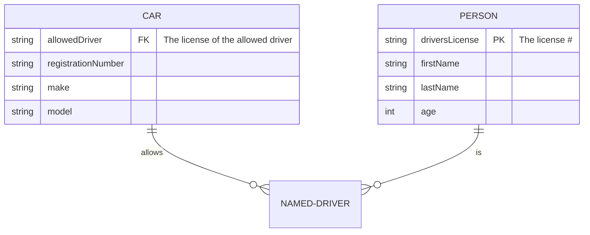

# Database

Every templates come with a very opinionated database structure that you cannot change. It allows to make some core concepts working amongst the time and frameworks so you cannot change that.

## Users table

Every toolkit have a concept of user.

Structure : 

Users:
- id: reference (could be an integer or uid)
- name: full name of the user
- password: password of the user
- last_name : last name of the user
- first_name : first name of the user
- email_verified_at
- language : the current user language in iso format
- created_at : created at time in YYYY-mm-dd H:i:s format
- updated_at : updated time in YYYY-mm-dd H:i:s format

Not mandatory but normalised
- image : the picture of the user (in a string format and full path)

