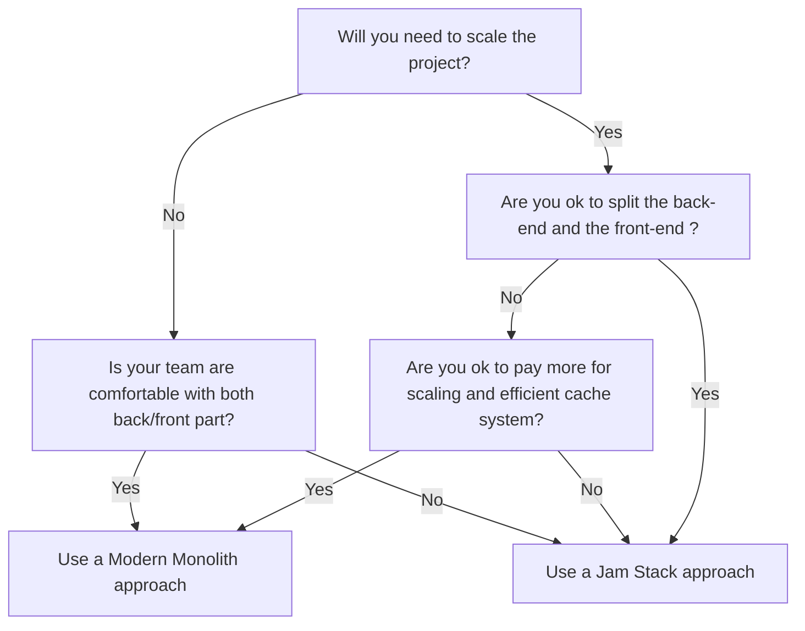

# Getting started

Let's discover **The Uptoolkit in less than 5 minutes**.

## Getting Started

Get started by **creating a new site** so you will learn the basic and the main core concepts.

### What you'll need

- [Node.js](https://nodejs.org/en/download/) version 16.14 or above. (We highly encourage you to install NVM https://github.com/nvm-sh/nvm#installing-and-updating)
- When installing Node.js, you are recommended to check all checkboxes related to dependencies.
- [Docker Desktop](https://www.docker.com/products/docker-desktop/)

## Using one of our boilerplate

You can use one of our boilerplate to start your project. We recommend using a Jam Stack approach and separe the
back-end (API, data) part from the Front-end (view, html) part when you might need to scale in the future.

Here is a small schema that might help you to pick the right decision :



- [Jam Stack approach](https://jamstack.org/) (front-end/back-end are splitted into micro services) :
    - Back-End :
        - [Express + Prisma + Graphql](https://github.com/uptoolkit/upback-express) (recommended)
        - [Upback Nest.js](https://github.com/uptoolkit/upback-nestjs)
        - [Upback Laravel](https://github.com/uptoolkit/upback-laravel)
        - [Django](https://github.com/uptoolkit/upback-django)
    - Front-End :
        - [Next.js](https://github.com/uptoolkit/upfront-nextjs)
        - [Nuxt.js](https://github.com/uptoolkit/upfront-nuxt)
    - CMS :
        - [Strapi](https://github.com/uptoolkit/upcms-strapi)
        - [Wordpress](https://github.com/uptoolkit/upcms-wordpress)

- Modern Monolith approach (everything in the same repository) :
    - [Next.js + Express + Prisma](https://github.com/uptoolkit/upfull-nextjs)
    - [Laravel + Tailwind + Inertia (React/Vue)](https://github.com/uptoolkit/upback-laravel)
    - [Adonis.js](https://github.com/uptoolkit/upback-adonis)
    - [Django](https://github.com/uptoolkit/upback-django)
    - [Rails](https://github.com/uptoolkit/upfull-rails)

## Start your app

You must read the installation guide in each Readme.md and also the documentation related to the Framework choosed.

But most of the projects have the same standard modus operandi :

```bash
cd my-website
npm install
npm run dev
```

or a standardized Docker setup : 

```bash
docker-composer up
```

The `cd` command changes the directory you're working with. In order to work with your newly created Docusaurus site,
you'll need to navigate the terminal there.

The `npm run dev` command builds your website locally and serves it through a development server, ready for you to view at http://localhost:3000/.
